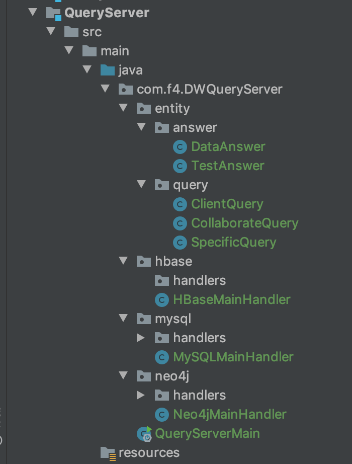

# Data warehouse
The course project for data warehouse. It consists of several parts as follows:

- pre-processor (python [textblob](https://textblob.readthedocs.io/en/dev/quickstart.html#textblobs-are-like-python-strings))
- web crawler (python [scrapy](https://scrapy.org/))
- instance matching (java [hadoop](https://hadoop.apache.org/))
- relational, graph and distributed DB injector (java)
- query server (java [spring boot](https://spring.io/))
- web controller (javascript [vue](https://vuejs.org/))

## 前期数据

前期数据在 /data 文件夹中，对其中文件对简要说明如下：
1.  DDL.sql （ SQL Server 中两张表的定义，只能用作参考，不能直接运行在其他的数据库上。
2.  loadReviewIntoADataBase.py （将从网站上下载的那个几个 G 的文件导入数据库的脚本，前半段可以直接用，也就是提取字段的那部分，后面要根据自己用的数据库来写）
3.  movieInfo.csv （从亚马逊爬的原始数据，是 Instance Matching 模块的原始输入）
4.  part-r-00000(1) （经过 Instance Matching 之后的文件，每一行是一个 json，可以用 FastJson 解析成对象，对象的定义在 InstanceMatching 模块中 Entity 包下的 MovieInfo.java。一个简单的例子如下
``` java
BufferedReader reader = new BufferedReader(new FileReader("/Users/zhangzijian/Downloads/DW/part-r-00000(1)"));
    for (int i = 0; i < 100; i++) {
      String line = reader.readLine();
      Movie movie = JSON.parseObject(line,Movie.class);
      loader.addMovieAlongWithDirectorAndActor(movie);
    } 
```

## 查询格式

前端给出的查询格式还有待讨论，现提出初稿

- 按照时间进行查询及统计（例如XX年有多少电影，XX年XX月有多少电影，XX年XX季度有多少电影，周二新增多少电影等） 
- 按照电影名称进行查询及统计（例如 XX电影共有多少版本等）
- 按照导演进行查询及统计（例如 XX导演共有多少电影等）
- 按照演员进行查询及统计（例如 XX演员主演多少电影，XX演员参演多少电影等）
- 按照演员和导演的关系进行查询及统计（例如经常合作的演员有哪些，经常合作的导演和演员有哪些）
- 按照电影类别进行查询及统计（例如 Action 电影共有多少，Adventure 电影共有多少等）
- 按照用户评价进行查询及统计（例如用户评分3分以上的电影有哪些，用户评价中有正面评价的电影有哪些等）
- 按照上述条件的组合查询和统计
 

首先，我觉得，API 分成两类：
1. 有起点查询（某段时间内的电影？）
2. 无起点查询（哪些演员经常合作？）

### 有起点查询
#### 对谁？
上面的查询中，都可以化成对「电影」对查询。
####用什么条件？
####查它的什么属性？
这两者是互斥的，用的条件越细，查询者能得到的有用的信息就越少，因为它们表达的都是电影

条件可以表达成以下对象（各个属性是 AND 还是 OR 仍需再定义）
```json
{
    "actors": [
        "skr",
        "qaz",
        "wsd"
    ],
    "comment": {
        "helpfulness": "3/11",
        "review_text": "This is  asf asfjsalf j alsdf alsf lsjf sal f",
        "score_from": 2.5,
        "score_to": 4.5,
        "summery": "Good!",
        "time_from": {
            "day_of_month": 23,
            "day_of_week": 1,
            "month": 5,
            "quarter": 2,
            "year": 2000
        },
        "time_to": {
            "day_of_month": 19,
            "day_of_week": 7,
            "month": 11,
            "quarter": 4,
            "year": 2013
        },
        "user_id": "DFKSF-234",
        "user_name": "zzj"
    },
    "directors": [
        "123"
    ],
    "main_actor": "skr",
    "movie_name": "skr skr jjj",
    "time_from": {
        "day_of_month": 4,
        "day_of_week": 2,
        "month": 1,
        "quarter": 1,
        "year": 1999
    },
    "time_to": {
        "day_of_month": 3,
        "day_of_week": 5,
        "month": 6,
        "quarter": 2,
        "year": 2016
    },
    "type": [
        "Action",
        "Fiction"
    ],
    "version": [
        "DVD"
    ]
}
```
对于符合某个条件的电影对象，我们可以查询以下的性质
- title
- actor
- id
- director
- date
- type
- version
- comment
### 无起点查询
1. 查询 /collaboration （哪些演员经常合作？哪些演员和导演经常合作？哪些导演经常一起执导？）
2. 查询 /similarUser   （哪些用户对电影的看法是一致的？）

collaboration 可以用类似以下对象来表达
```json
{
	"type":1,  // 种类
	"threshold":4
}
```
similar user 可以用类似以下对象来表达
```json
{
	"type":1, // 种类（是相近还是相反？）
	"threshold":4,// 多少次出现相近认为两个用户是相似的？
        "delta":0.5  // 评分差距多少可以认为是相近？
}
```
### 体现一些变化
#### 对时间搜索：
1. 直接存储时间戳，对所有对取出来遍历（java 端得到范围）
2. 直接存储各个时间属性
3. 在属性上做索引
4. 把属性抽离为实体

## HbaseQuerier Server 模版说明

在完成了数据的导入之后，需要完成数据的查询工作，我们定义了统一的模版从而简化工作。简要说明如下：



我们可以清楚的看到，有四个字模块，分别是

- entity （存放问题与答案，都是实体类，具有标准的 getter 和 setter 函数，用于实例化前端对象并向前端返回对象）
- mysql
- hbase
- neo4j

其中，后三个模块就是各个自己的查询，他们的主函数（也就是获得前端数据以及返回给前端的地方就在 ***MainHandler 类中，每个类的定义都大致如下所示

```java
@RestController
public class HBaseMainHandler {
    @PostMapping("/HBase/specify")
    public Object handleSpecifyQuery(@RequestBody SpecificQuery specificQuery){
        return new DataAnswer();
    }
    @PostMapping("/HBase/general/collaboration")
    public Object handleCollaborationQuery(@RequestBody CollaborateQuery collaborateQuery){
        return  new DataAnswer();
    }
}
```

可以看到，你将可以在函数体中获得整个 query 对象，根据要求，你将会返回 DataAnswer（询问具体数据，顺便返回时间） 或者是 TestAnswer（获取查询时间）。